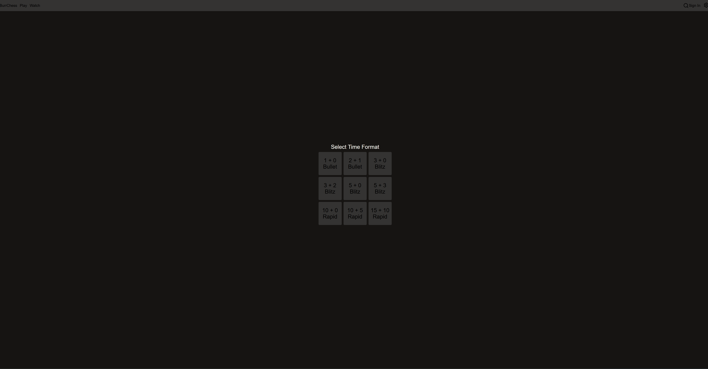

# BurrChess

A full-stack chess platform built with React and Go — inspired by Lichess. Play rated games, track your history, and spectate live matches.


## Features

- **Server-side move validation** — every move is verified by a Go chess engine before being accepted. The client can never submit an illegal move.
- **Elo-based matchmaking** — separate queues per time format (bullet, blitz, rapid etc.) so ratings stay meaningful across game types.
- **Live play over WebSockets** — moves, takeback requests, draw offers, and resignations are all transmitted in real time. Spectators are supported.
- **Optional accounts** — play immediately as a guest or create an account to track match history and an Elo rating over time.
- **Player profiles** — search for any registered player to view their profile and game history.

## Why I built it

I wanted a project that forced me to connect a React frontend to a real backend — not a toy API, but something with authentication, persistent state, real-time communication, and enough product complexity to make the architecture decisions matter. Chess was a good fit: the rules are well-defined, but building something that feels like a product (matchmaking, ratings, spectators) required thinking carefully about how the pieces fit together.

## Architecture

- **Go backend with `net/http`** — no framework. REST endpoints handle accounts, matchmaking, and game history. WebSocket connections handle live game state.
- **Server-side chess engine** — move legality is enforced on the server. The frontend sends intended moves; the backend validates and either applies or rejects them. Clients cannot cheat by modifying local state.
- **REST + WebSockets** — REST for everything stateless (auth, profiles, history), WebSockets for everything live (moves, offers, spectators). Each protocol does what it's suited for.
- **SQLite** — stores user accounts, Elo ratings, and match history. Straightforward and sufficient for the scale of a personal project.

## Getting started

```powershell
# Backend
cd backend
go build ./cmd/web && web.exe

# Frontend (in a separate terminal)
cd frontend
npm install
npm run dev
```

Open `http://localhost:5173` to play.

